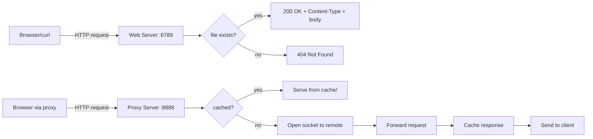

# Web Server and Caching Proxy

> An HTTP web server and a caching HTTP proxy in Python, built from raw sockets without web frameworks. Standard library only: `socket`, `os`, `mimetypes`. Manual HTTP/1.0 parsing, file serving with MIME type detection, and cache-key-based response storage. ~390 lines of Python.

[](https://www.python.org)
[](LICENSE)

---

## What it is

Two cooperating components that together demonstrate low-level HTTP from the bottom up:

- **`webserver.py`**: listens on `localhost:6789`, parses HTTP GET requests, serves files from the current directory with the correct MIME type, returns 404 for missing files.
- **`proxyserver.py`**: listens on `localhost:8888`, intercepts HTTP GET requests, checks a local `cache/` directory for a matching response, and either serves the cached version or forwards the request to the remote server (caching the response for next time).

No frameworks. No `asyncio`. No third-party libraries. Just sockets, file I/O, and a hand-written HTTP parser. The point is to see what a framework actually abstracts.

This is a study in:

- **Manual HTTP parsing**: parsing the request line, splitting on CRLF, extracting headers, building the status line and response headers byte by byte.
- **Socket lifecycle**: bind, listen, accept, recv, sendall, close. Single-threaded sequential handling.
- **Cache-key generation**: how do you turn a URL into a filename without collisions?
- **Binary file handling**: opening files in `"rb"` mode and sending as bytes (not UTF-8 decoded), critical for images.
- **Forward proxying**: parsing the original request, opening a fresh socket to the remote host, replaying the request with adjusted headers (`Host`, `Connection: close`).

## Quick start

```bash
# Run the web server (in one terminal)
python3 webserver.py
# Listening on localhost:6789

# In another terminal, hit it
curl http://localhost:6789/HelloWorld.html
curl http://localhost:6789/jpeg.jpg --output /tmp/out.jpg
curl -i http://localhost:6789/missing.html  # 404

# Run the proxy (in a third terminal)
python3 proxyserver.py
# Listening on localhost:8888

# Configure a client to use the proxy
curl --proxy http://localhost:8888 http://example.com/
# First request: cache miss, forwarded to example.com
# Second request: cache hit, served from local cache/ directory
```

## Architecture at a glance



Both components are single-threaded. They `accept()`, handle one connection synchronously, close, then loop back. Slow client = blocked server. Acceptable for the scope; production proxies use threading or async I/O.

For the full request-handling flows, header parsing, and cache-key strategy, see [`docs/ARCHITECTURE.md`](docs/ARCHITECTURE.md).

For the engineering decisions and their alternatives, see [`docs/DECISIONS.md`](docs/DECISIONS.md).

## Code worth highlighting

### Manual HTTP request parsing

```python
def handle_client(client_socket):
    request = client_socket.recv(1024)
    request_text = request.decode('utf-8')

    request_lines = request_text.split("\r\n")
    first_line = request_lines[0].split()  # ["GET", "/index.html", "HTTP/1.1"]

    if len(first_line) < 2 or first_line[0] != "GET":
        return

    filename = first_line[1].lstrip("/")
    if filename == "":
        filename = "nonexistentfile"

    if os.path.exists(filename) and os.path.isfile(filename):
        content_type, _ = mimetypes.guess_type(filename)
        content_type = content_type or "application/octet-stream"

        with open(filename, "rb") as file:
            file_data = file.read()

        response = (
            f"HTTP/1.0 200 OK\r\n"
            f"Content-Type: {content_type}\r\n"
            f"Content-Length: {len(file_data)}\r\n"
            f"\r\n"
        )
        client_socket.sendall(response.encode())
        client_socket.sendall(file_data)
    else:
        not_found = (
            "HTTP/1.0 404 Not Found\r\n"
            "Content-Type: text/html\r\n"
            "\r\n"
            "<html><body>404 Not Found</body></html>"
        )
        client_socket.sendall(not_found.encode())
    client_socket.close()
```

The blank line between headers and body (`\r\n\r\n`) is the part everyone forgets. Skip it once and the client cannot parse your response.

### Proxy cache lookup and forward

```python
def handle_client(client_socket):
    request_data = client_socket.recv(4096)
    request_text = request_data.decode('utf-8', errors='ignore')

    lines = request_text.split('\r\n')
    request_line = lines[0].split()
    method = request_line[0].upper()
    url = request_line[1]

    if method != 'GET' or url.startswith("https://") or url.startswith('/'):
        return  # Only HTTP GET with absolute URLs

    if url.startswith("http://"):
        url = url[len("http://"):]

    parts = url.split('/', 1)
    hostname = parts[0]
    path = "/" + parts[1] if len(parts) > 1 else "/"
    cache_key = url.replace('/', '_')

    cached = get_cached_content(cache_key)
    if cached:
        client_socket.sendall(cached)
        return

    with socket.socket(socket.AF_INET, socket.SOCK_STREAM) as server_sock:
        server_sock.settimeout(10)
        server_sock.connect((hostname, 80))
        forward = (
            f"GET {path} HTTP/1.0\r\n"
            f"Host: {hostname}\r\n"
            f"Connection: close\r\n"
            f"\r\n"
        )
        server_sock.sendall(forward.encode())

        response = b""
        while True:
            chunk = server_sock.recv(4096)
            if not chunk:
                break
            response += chunk

        cache_content(cache_key, response)
        client_socket.sendall(response)
```

The forwarded request is rewritten: the absolute URL becomes a path, a fresh `Host` header is added, and `Connection: close` ensures the remote sends EOF when finished so the proxy knows when to stop reading.

## Tradeoffs and what I would do differently

**Single-threaded sequential handling.** Simple to reason about, but one slow client blocks all others. Production proxies use threading (one thread per connection, like the [thread-per-connection design from MazeWar](https://github.com/FardinIqbal/concurrent-network-game-server)) or async I/O (`asyncio` or `selectors`). For a study project, sequential is fine.

**HTTP/1.0 only.** Avoids chunked transfer encoding and persistent connections. Real proxies must handle HTTP/1.1's `Transfer-Encoding: chunked` and `Connection: keep-alive` headers. The parser would also need to handle pipelined requests on a single connection.

**Cache key as `url.replace('/', '_')`.** Trivial, fragile. Long URLs blow past filesystem limits; special characters in URLs collide; query strings make different URLs map to the same cache file. A real proxy uses hashing (MD5 or SHA-256) and stores the original URL as metadata.

**No cache invalidation.** Cache is permanent. A real proxy honors `Cache-Control` headers (`max-age`, `must-revalidate`, `no-cache`), `ETag`, and `If-Modified-Since`. Cache invalidation is one of the two hard problems in computer science.

**No HTTPS support.** The proxy rejects `https://` URLs. Real proxies handle HTTPS via the `CONNECT` method, which tunnels TCP through the proxy without inspecting the encrypted bytes.

## Building and running

Requirements:

- Python 3 (any modern version; 3.8+ tested)
- No external libraries

```bash
# Web server
python3 webserver.py

# Proxy server (separate terminal)
python3 proxyserver.py

# Test the cache: hit the proxy twice, second one is a cache hit
curl --proxy http://localhost:8888 http://example.com/
curl --proxy http://localhost:8888 http://example.com/  # served from cache/

# Inspect the cache
ls cache/
```

## Project structure

```
.
├── webserver.py            HTTP web server (port 6789)
├── proxyserver.py          HTTP caching proxy (port 8888)
├── HelloWorld.html         Sample file for the web server to serve
├── jpeg.jpg                Sample binary file
├── png.png                 Sample binary file
├── docs/
│   ├── ARCHITECTURE.md     Full request-handling flows, header parsing, cache strategy
│   └── DECISIONS.md        Engineering decisions and alternatives
└── README.md
```

## Documentation

- [`docs/ARCHITECTURE.md`](docs/ARCHITECTURE.md): full architecture reference. Request parsing flow, response construction, cache key strategy, binary file handling, socket lifecycle.
- [`docs/DECISIONS.md`](docs/DECISIONS.md): ADRs for the engineering choices: single-threaded design, HTTP/1.0 only, cache key strategy, MIME type detection, no HTTPS.

## License

MIT. See [`LICENSE`](LICENSE).

## Author

Fardin Iqbal. Built as part of CSE Computer Networks at Stony Brook University.
