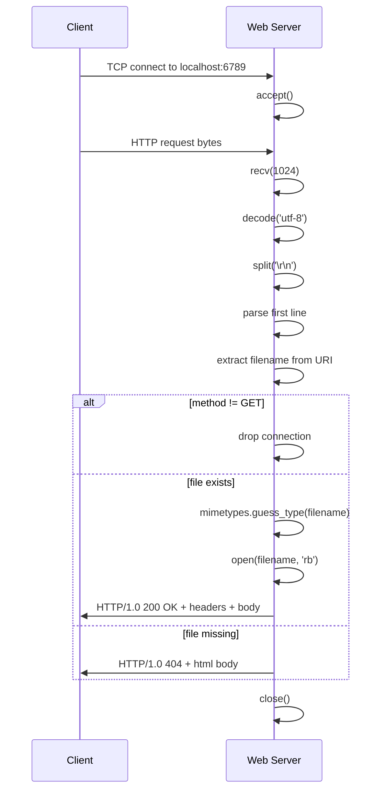
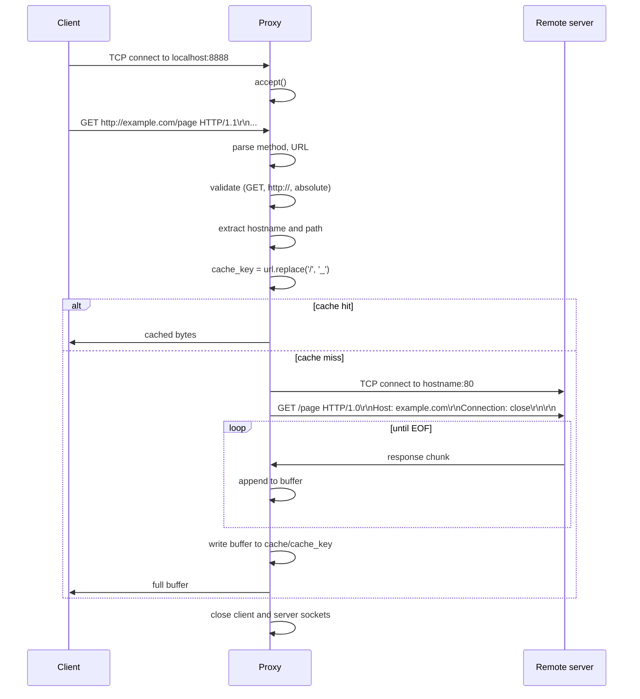

# Architecture

Deep reference for both the web server and the caching proxy. Read this when you want to understand the request-handling flow, response construction, cache key strategy, or socket lifecycle.

## Web server (port 6789)

### Request handling flow



### Response construction

For a 200 OK response with a file body:

```
HTTP/1.0 200 OK\r\n
Content-Type: image/jpeg\r\n
Content-Length: 41827\r\n
\r\n
<41827 bytes of JPEG data>
```

The blank line (`\r\n\r\n`) between headers and body is mandatory. Without it, the client cannot tell where headers end. Forgetting this is the #1 bug when writing HTTP from scratch.

### MIME type detection

`mimetypes.guess_type()` looks at the file extension and returns the standard MIME type. Falls back to `application/octet-stream` for unknown extensions. Production servers use magic-number detection (the first few bytes of the file) for robustness, but extension-based is the typical default.

### Binary vs text file handling

```python
with open(filename, "rb") as file:  # 'rb' is critical
    file_data = file.read()
```

Opening in `"rb"` (read binary) mode returns `bytes`. Opening in `"r"` (read text) mode tries to decode as UTF-8 and fails for binary content (JPEGs, PNGs). Always `"rb"`.

When sending, the response headers are encoded:

```python
client_socket.sendall(response_headers.encode())  # str → bytes
client_socket.sendall(file_data)                   # already bytes
```

Two `sendall()` calls instead of concatenating. `sendall()` retries on partial sends, so this is safe.

### Edge cases

| Input | Handling |
|-------|----------|
| Empty filename (`/`) | Treated as nonexistent, returns 404 |
| Method other than GET | Connection silently dropped |
| Path with `..` | Not specifically blocked. Production servers block path traversal. |
| Filename with no extension | MIME type defaults to `application/octet-stream` |
| Concurrent connections | Sequential. Connection N blocks until connection N-1 finishes. |

## Proxy server (port 8888)

### Request handling flow



### URL parsing

The proxy receives full URLs (with `http://` prefix) in the request line. It strips the protocol, splits on `/` to extract hostname and path, and forwards the request to the hostname.

```python
url = "http://example.com/page?id=42"
url = url[len("http://"):]              # "example.com/page?id=42"
parts = url.split('/', 1)               # ["example.com", "page?id=42"]
hostname = parts[0]                     # "example.com"
path = "/" + parts[1]                   # "/page?id=42"
```

### Forwarded request

The proxy rewrites the original request:

- The full URL becomes a path
- A fresh `Host` header is added (the proxy is the new HTTP/1.0 client)
- `Connection: close` is added so the remote sends EOF when finished
- All other headers are dropped (a real proxy would forward most of them)

```
Original (from client):
GET http://example.com/page HTTP/1.1
Host: example.com
User-Agent: curl/7.68.0
Accept: */*

Forwarded (from proxy to remote):
GET /page HTTP/1.0
Host: example.com
Connection: close
```

### Cache key

```python
cache_key = url.replace('/', '_')
```

For the URL `example.com/page?id=42`, the cache key is `example.com_page?id=42`. Stored as a file in `cache/example.com_page?id=42`.

This is fragile (see [DECISIONS.md ADR 3](DECISIONS.md)) but works for the common case.

### Cache read and write

```python
def get_cached_content(cache_key):
    path = os.path.join("cache", cache_key)
    if not os.path.exists(path):
        return None
    with open(path, "rb") as f:
        return f.read()

def cache_content(cache_key, content):
    os.makedirs("cache", exist_ok=True)
    path = os.path.join("cache", cache_key)
    with open(path, "wb") as f:
        f.write(content)
```

Cache files contain the entire HTTP response (status line, headers, body). When serving a cache hit, the proxy sends the response bytes verbatim.

### Edge cases

| Input | Handling |
|-------|----------|
| `https://` URL | Rejected. Proxy does not support TLS. |
| Relative URL (starting with `/`) | Rejected. Proxy expects absolute URLs from CONNECT-less clients. |
| Method other than GET | Rejected. |
| Connection timeout to remote (10s) | Connection dropped, no cache write. |
| Cache directory missing | Created on first cache write. |
| Server returns `Content-Encoding: gzip` | Stored as-is in cache. Client receives the encoded bytes. |

## Socket lifecycle

Both servers follow the same pattern:

```python
listen_sock = socket.socket(socket.AF_INET, socket.SOCK_STREAM)
listen_sock.setsockopt(socket.SOL_SOCKET, socket.SO_REUSEADDR, 1)
listen_sock.bind(('localhost', PORT))
listen_sock.listen()

while True:
    client_sock, addr = listen_sock.accept()
    handle_client(client_sock)  # synchronous, blocks until done
    # client_sock closed inside handle_client
```

`SO_REUSEADDR` lets the server restart immediately after a crash without waiting for the kernel's `TIME_WAIT` to clear. Otherwise, you get "Address already in use" for a few minutes after each shutdown.

`accept()` blocks until a connection arrives. There is no timeout, no cancellation. The server runs forever until killed.

## What this code does NOT do

For comparison with a real HTTP server, here is what is missing:

- **Threading or async**: one connection at a time.
- **HTTP/1.1**: no chunked encoding, no persistent connections.
- **HTTPS**: no TLS, no `CONNECT` method.
- **Cache invalidation**: no `Cache-Control` honoring, no `If-Modified-Since`.
- **Path traversal protection**: no `..` blocking.
- **Logging**: stdout `print` only; no structured logs.
- **Error pages**: 404 is the only non-200 response.
- **Graceful shutdown**: Ctrl-C is the only way to stop.
- **Configuration**: ports are hardcoded.
- **Compression**: no `gzip` or `br` for outgoing responses.

These are deliberate omissions. The exercise is to see HTTP at its rawest. Adding any of these would obscure the protocol behind framework abstractions.
